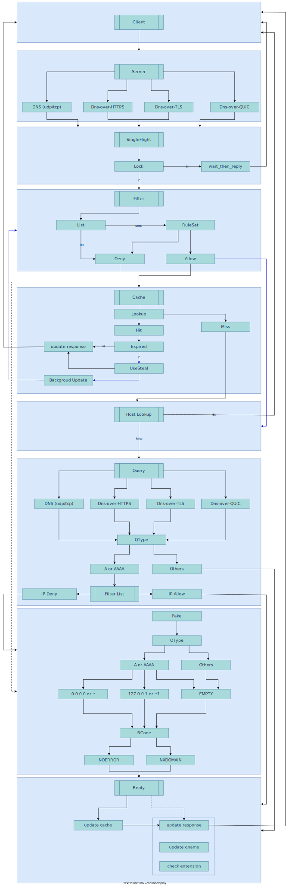

# gnamed

## Description

### Why create this tools
1. more flexible dns query filter to block some domains
2. prevent dns injection and other security issue under some network

### What it can do
1. flexible rules or filters to block domains, rules equal/prefix/suffix/regexp were supported
2. multi dns protocol support, dns/dns-over-https/dns-over-tls/dns-over-quic were supported
3. flexible dns cache rule support (this might violated dns rfc)
4. forward different domain/zone to more than one different nameservers, to get better result
5. collect personal dns query log, to identify security issue or something
6. hijacking some domain or query type

## Install
```
# default all features
go build

# disable dns-over-quic
go build -tags="noquic"

# on linux platform, use epoll event to detect closed connection, to disable it, use tag "detect_common"
go build -tags="detect_common"

# reduce binary size
go build -ldflags '-s -w'
```

## Architecture


## Usage

### Help
```
$ gnamed --help
Usage of gnamed:
  -config-file string
        config file (default "./configx/config.json")
  -dump-json
        dump configuration with json format, then exit
  -verbose
        verbose
```

### Run
```
$ gnamed
{"level":"debug","log_type":"main","op_type":"start","time":"2023-08-18T12:26:26+08:00"}
{"level":"info","log_type":"filter","op_type":"load","filter_name":"phishing_army_blocklist_extended","syntax":"domain","stats":{"total":161411,"valid":161411,"invalid":0},"elapsed_time":148.2475,"time":"2023-08-18T12:26:26+08:00"}
{"level":"info","log_type":"filter","op_type":"load","filter_name":"oisd_big_abp","syntax":"adblock","stats":{"total":247034,"valid":247034,"invalid":0},"elapsed_time":224.4434,"time":"2023-08-18T12:26:26+08:00"}
{"level":"info","log_type":"filter","op_type":"load","elapsed_time":224.4434,"stats":{"total":2,"error":0,"success":2,"skip":0},"time":"2023-08-18T12:26:26+08:00"}
{"level":"trace","log_type":"cache","cache_mode":"skiplist","max_level":32,"probability":0.5,"time":"2023-08-18T12:26:26+08:00"}
{"level":"info","log_type":"server","address":"127.0.1.2:53","network":"tcp","protocol":"dns","time":"2023-08-18T12:26:26+08:00"}
{"level":"info","log_type":"server","address":"127.0.1.2:53","network":"udp","protocol":"dns","time":"2023-08-18T12:26:26+08:00"}
{"level":"info","log_type":"server","protocol":"dns","network":"udp","clientip":"127.0.0.1","id":3,"name":"google.com.","qtype":"A","qclass":"IN","view_name":"google.com.","query_type":"external","queries":[{"nameserver_tag":"tag_doh_cf","protocol":"https","network":"tcp","doh_msg_type":"RFC8484","id":0,"name":"google.com.","method":"POST","doh_url":"https://1.1.1.1/dns-query","status_code":200,"latancy":360.7854}],"latency_query":360.7854,"rcode":"NOERROR","cache":"update","singleflight":false,"latency":361.4834,"time":"2023-08-18T12:26:39+08:00"}
{"level":"info","log_type":"server","protocol":"dns","network":"udp","clientip":"127.0.0.1","id":5,"name":"github.com.","qtype":"A","qclass":"IN","view_name":"github.com.","query_type":"external","queries":[{"nameserver_tag":"tag_dot_cf","protocol":"tls-tcp","network":"tcp-tls","id":42485,"name":"github.com.","latency":161.8645}],"latency_query":481.7437,"rcode":"NOERROR","cache":"update","singleflight":false,"latency":481.9434,"time":"2023-08-18T12:26:42+08:00"}
```

## Features
* [x] Server: dns/dns-over-tls/dns-over-quic/dns-over-http
* [x] Query: dns/dns-over-tls/dns-over-quic/dns-over-http(3)
* [x] Cache: flexible ttls value, background update steal values
* [x] API: delete value from ache / reload configuration
* [x] Security: public free malware/ad filter lists, flexible black and white list
* [x] Warm: auto store and reload domains that used in high frequency at shutdown and startup

### TODO-List
* [x] server: dns protocol support
* [x] server: dns-over-https protocol support
* [x] server: dns-over-tls protocol support
* [x] server: dns-over-quic protocol support
* [x] server: ensure singleflight incoming query
* [x] query: dns protocol support
* [x] query: dns-over-https protocol support
* [x] query: dns-over-tls protocol support
* [x] query: dns-over-quic protocol support
* [ ] query: flexible view match rules, for example 'contains'
* [x] query: dns-over-https support auto detect that the server supported ALPN
* [x] cache: delete expired cache actively
* [ ] cache: dns-over-https cache ttl should be calculated base on both http cache header and dns record ttl
* [x] reply: update ttl when response from cache
* [x] api: cache operations: delete/flush
* [ ] api: dns query statistics: NXDOMAIN(security audit), Qtype, not NOERROR
* [x] api: update blacklist/whitelist
* [ ] web: web ui make api easy use
* [ ] doc: openapi https://github.com/swaggo/swag#how-to-use-it-with-gin
* [ ] optimization: blacklist/whitelist `contains` rule match algorithm, Aho-Corasick or flashtext
* [x] optimization: singleflight outgoing query (dns-over-https)
* [ ] optimization: select lowest rtt record (cdn domain)
* [x] optimization: log format and fields
* [ ] optimization: algorithm to get dns response cache ttl
* [ ] optimization: select server base on latency
* [x] security: filter by ip or domain, ad or malware https://gitlab.com/malware-filter/urlhaus-filter
* [ ] privacy: HTTP/TLS Fingerprint (cipher suit order http headers)

## References
### NameServers
##### Collections
1. https://dnsprivacy.org/public_resolvers/
2. https://github.com/curl/curl/wiki/DNS-over-HTTPS#publicly-available-servers

##### Info

| Name | Protocol | Reference |
| - | - | - |
| Cloudflare | DOH/DOT/DNS | https://developers.cloudflare.com/1.1.1.1/ |
| Nextdns | DOH/DOT/DNS | https://my.nextdns.io/start |
| AdGuard | DOH/DOT/DOQ/DNS/DNSCrypt| https://adguard-dns.io/en/public-dns.html |
| Google | DOH/DOT/DNS | https://developers.google.com/speed/public-dns |
| Quad9 | DOH/DOT/DNS | https://www.quad9.net/ |

### RFC
1. [Draft-IETF - Service binding and parameter specification via the DNS (DNS SVCB and HTTPS RRs)](hhttps://datatracker.ietf.org/doc/draft-ietf-dnsop-svcb-https/)
2. [IANA - dns-parameters](https://www.iana.org/assignments/dns-parameters/dns-parameters.xhtml)
3. [ICANN - DNS-related RFCs with Community Annotations](https://rfc-annotations.research.icann.org/)
4. [RFC1034 - DOMAIN NAMES - CONCEPTS AND FACILITIES](https://www.rfc-editor.org/rfc/rfc1034)
5. [RFC1035 - DOMAIN NAMES - IMPLEMENTATION AND SPECIFICATION](https://www.rfc-editor.org/rfc/rfc1035.html)
6. [RFC1912 - Common DNS Operational and Configuration Errors](https://www.rfc-editor.org/rfc/rfc1912)
7. [RFC4033 - DNS Security Introduction and Requirements](https://www.rfc-editor.org/rfc/rfc4033.html)
8. [RFC4074 - Common Misbehavior Against DNS Queries for IPv6 Addresses](https://www.rfc-editor.org/rfc/rfc4074.html)
9. [RFC5625 - DNS Proxy Implementation Guidelines](https://www.rfc-editor.org/rfc/rfc5625.html)
10. [RFC6147 - DNS64: DNS Extensions for Network Address Translation from IPv6 Clients to IPv4 Servers](https://www.rfc-editor.org/rfc/rfc6147.html)
11. [RFC6840 - Clarifications and Implementation Notes for DNS Security (DNSSEC)](https://www.rfc-editor.org/rfc/rfc6840)
12. [RFC6891 - Extension Mechanisms for DNS (EDNS(0))](https://www.rfc-editor.org/rfc/rfc6891)
13. [RFC7766 - DNS Transport over TCP - Implementation Requirements](https://www.rfc-editor.org/rfc/rfc7766)
14. [RFC7858 - Specification for DNS over Transport Layer Security (TLS)](https://www.rfc-editor.org/rfc/rfc7858.html)
15. [RFC7871 - Client Subnet in DNS Queries](https://www.rfc-editor.org/rfc/rfc7871)
16. [RFC7873 - Domain Name System (DNS) Cookies](https://www.rfc-editor.org/rfc/rfc7873)
17. [RFC8085 - UDP Usage Guidelines](https://www.rfc-editor.org/rfc/rfc8085.html)
18. [RFC8310 - Usage Profiles for DNS over TLS and DNS over DTLS](https://www.rfc-editor.org/rfc/rfc8310)
19. [RFC8484 - DNS Queries over HTTPS (DoH)](https://datatracker.ietf.org/doc/html/rfc8484)
20. [RFC8499 - DNS Terminology](https://www.rfc-editor.org/rfc/rfc8499)
21. [RFC8906 - A Common Operational Problem in DNS Servers: Failure to Communicate](https://www.rfc-editor.org/rfc/rfc8906.html)
22. [RFC9000 - QUIC: A UDP-Based Multiplexed and Secure Transport](https://www.rfc-editor.org/rfc/rfc9000.html)
23. [RFC9018 - Interoperable Domain Name System (DNS) Server Cookies](https://www.rfc-editor.org/rfc/rfc9018.html)
24. [RFC9114 - HTTP/3](https://www.rfc-editor.org/rfc/rfc9114.html)
25. [RFC9210 - DNS Transport over TCP - Operational Requirements](https://www.rfc-editor.org/rfc/rfc9210)
26. [RFC9230 - Oblivious DNS over HTTPS](https://www.rfc-editor.org/rfc/rfc9230.html)
27. [RFC9250 - DNS over Dedicated QUIC Connections](https://www.rfc-editor.org/rfc/rfc9250)

### Paper
1. [DNS Rebinding](https://crypto.stanford.edu/dns/dns-rebinding.pdf)

### Others
1. [BlackHat - eu-17-Shuster-Passive-Fingerprinting-Of-HTTP2-Clients-wp.pdf](https://www.blackhat.com/docs/eu-17/materials/eu-17-Shuster-Passive-Fingerprinting-Of-HTTP2-Clients-wp.pdf)
2. [Show Your HTTP2 Fingerprint - https://tls.peet.ws/api/all](https://tls.peet.ws/api/all)
3. [APNIC - are-large-dns-messages-falling-to-bits](https://blog.apnic.net/2021/06/16/are-large-dns-messages-falling-to-bits/)
4. [Check My DNS](https://cmdns.dev.dns-oarc.net/)
5. [dnsflagday](https://www.dnsflagday.net/2020/)
6. [Tranco: A Research-Oriented Top Sites Ranking Hardened Against Manipulation](https://arxiv.org/abs/1806.01156)

### Data
##### Filter Lists
1. https://oisd.nl
2. https://phishing.army
3. https://gitlab.com/malware-filter/urlhaus-filter
4. https://github.com/badmojr/1Hosts
5. https://github.com/hectorm/hmirror/tree/master/data
6. https://someonewhocares.org/hosts/zero/hosts

##### Others
1. [public suffix list](https://publicsuffix.org/list/public_suffix_list.dat)
2. [A Research-Oriented Top Sites Ranking Hardened Against Manipulation](https://tranco-list.eu/)


# FIXME
1. singleflight need to set timeout. not alwasy wait pre-query response.
